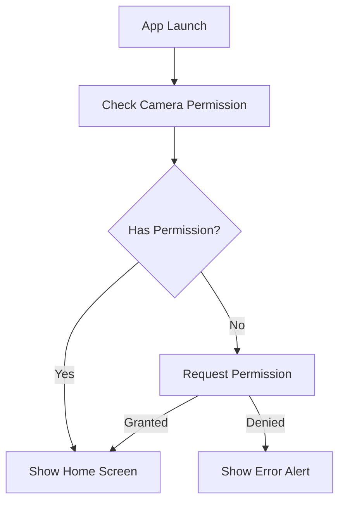
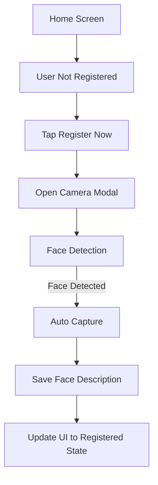
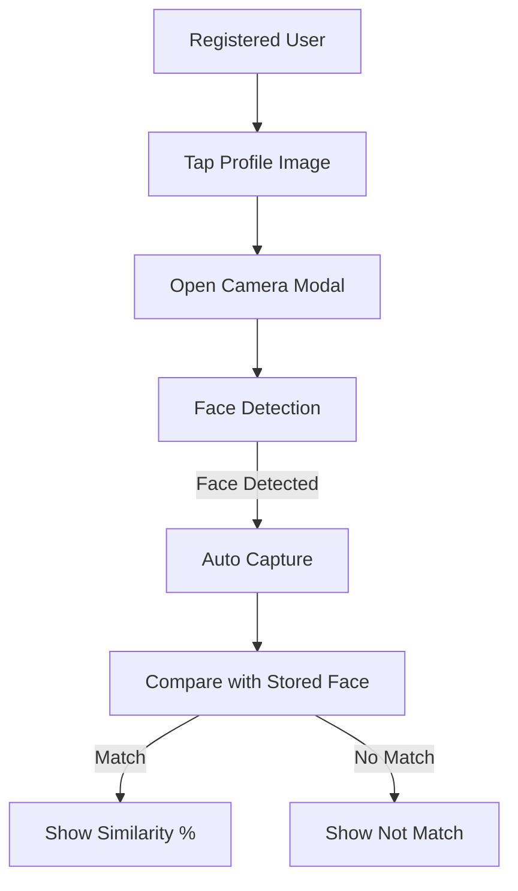

# React Native Face Recognition App

A React Native application that performs face recognition using the device's camera. The app allows users to register their face and then use it for recognition.

## Project Structure

The project has a minimalist structure with two main files:

1. `App.tsx` - Contains all the application logic including:
   - Main application component
   - Camera modal functionality
   - Permission handling
   - UI components and styling
   - Face detection and recognition logic

2. `src/utils/storage.ts` - Handles all storage operations:
   - Face description storage
   - Face comparison logic
   - AsyncStorage operations

## Features

- Face registration and recognition
- Real-time face detection
- Local storage using AsyncStorage
- Modern and responsive UI
- Camera permission handling
- Error handling and user feedback

## Workflow

### 1. Initial App Launch

### 2. Registration Flow

### 3. Recognition Flow

## Detailed Workflow Explanation

### 1. App Initialization
- App checks for camera permissions using `useGetPermission` hook
- If permission not granted, requests it from the user
- Shows appropriate alerts for permission status

### 2. Registration Process
- When user is not registered:
  - Shows "Register Now" button
  - On tap, opens camera modal
  - Camera continuously scans for faces
  - When face detected:
    - Shows green indicator
    - Automatically captures image
    - Converts image to base64
    - Saves face description to AsyncStorage
    - Updates UI to show registered state

### 3. Face Recognition Process
- When user is registered:
  - Shows profile image with "Tap to scan" overlay
  - On tap, opens camera modal
  - Camera scans for faces
  - When face detected:
    - Captures new image
    - Retrieves stored face description from AsyncStorage
    - Compares new face with stored face
    - Shows result:
      - If match: Displays similarity percentage
      - If no match: Shows "Not Match"

### 4. Additional Features
- Clear Results:
  - Clears current recognition result
  - Keeps registration intact
- Logout:
  - Clears registration
  - Returns to unregistered state
- Clear Storage:
  - Clears all stored face descriptions
  - Returns to initial state

### 5. Error Handling
- Camera errors show alerts
- Face detection failures show appropriate messages
- Storage operations have error handling
- Loading states shown during operations

### 6. UI Feedback
- Loading indicators during operations
- Color-coded results (green for match, red for no match)
- Clear status messages
- Visual feedback for face detection

## Key Components

### 1. Home Screen (`Home.tsx`)
- Main interface
- Handles registration and recognition states
- Manages UI updates and user interactions

### 2. Camera Modal (`ModalCameraAuto.tsx`)
- Handles camera operations
- Manages face detection
- Provides visual feedback
- Handles image capture

### 3. Storage Utility (`storage.ts`)
- Manages face description storage
- Handles face comparison
- Provides AsyncStorage operations

### 4. Permission Hook (`useGetPermission.ts`)
- Manages camera permissions
- Handles permission requests
- Provides permission status

## Technical Details

### Dependencies
- react-native-vision-camera
- vision-camera-face-detector
- @react-native-async-storage/async-storage
- react-native-reanimated

### Code Organization
- All UI components and business logic are consolidated in `App.tsx`
- Storage operations are separated in `storage.ts` for better maintainability
- Clean and modular code structure within single file
- Clear separation of concerns between UI/logic and storage operations

### Storage Implementation
- Uses AsyncStorage for local data persistence
- Stores face descriptions as base64 strings
- Implements simple face comparison logic

### Camera Implementation
- Uses front camera for face detection
- Implements frame processor for real-time face detection
- Auto-captures when face is detected
- Provides visual feedback during capture

## UI/UX Features

### Modern Design
- Clean and intuitive interface
- Responsive layout
- Proper spacing and alignment
- Visual feedback for all actions

### User Feedback
- Loading indicators
- Status messages
- Error alerts
- Success confirmations

### Accessibility
- Clear button labels
- High contrast colors
- Proper touch targets
- Status indicators

## Error Handling

### Camera Errors
- Permission denials
- Camera initialization failures
- Capture errors

### Storage Errors
- Save failures
- Read failures
- Comparison errors

### UI Error States
- Loading states
- Error messages
- Retry options

## Future Improvements

1. **Enhanced Face Recognition**
   - Implement more sophisticated face comparison algorithms
   - Add multiple face registration support
   - Improve accuracy of face detection

2. **Security Enhancements**
   - Add encryption for stored face data
   - Implement secure storage options
   - Add authentication layers

3. **UI Improvements**
   - Add dark mode support
   - Implement custom animations
   - Add more user feedback options

4. **Performance Optimization**
   - Optimize image processing
   - Improve camera performance
   - Enhance storage operations

## Contributing

Feel free to submit issues and enhancement requests!
